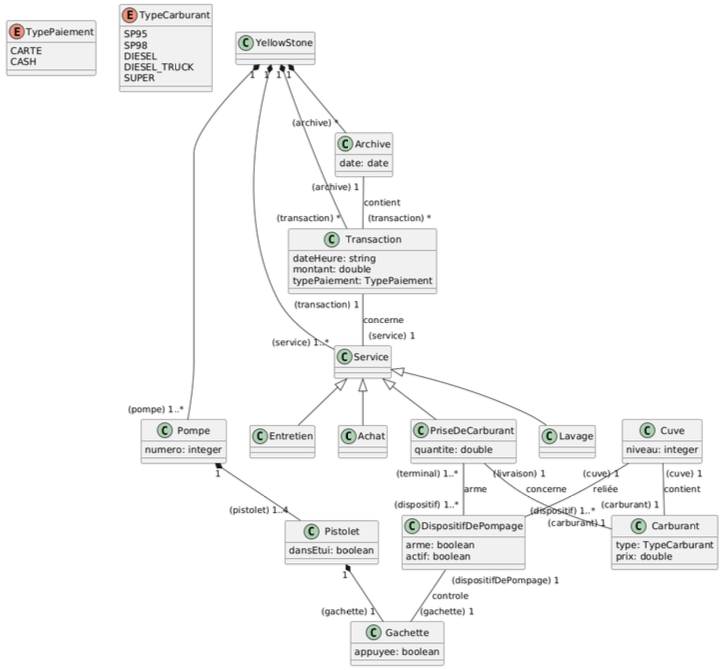

This chapter presents a practical case study, "Yellow Stone," to apply the UML modeling concepts discussed previously, including Class Diagrams, OCL constraints, and Object Diagrams. This exercise is based on a previous exam question and is intended for practice. The goal is to analyze the structure of the system and represent it using the appropriate UML diagrams and OCL.

## Case Study: Yellow (Vest) Stone

Discontent is simmering in the country, cars are burning, and fuel is becoming scarce. As the manager of the Yellow Stone station, you watch with dread the growing unrest and the increasingly insistent parade of Teslas. Nevertheless, to survive and meet the inevitable surge in demand that will follow this (first) crisis, you want to take advantage of the holidays to invest in new software to manage the station.

### Multi-Services

Currently consisting of 5 pumps arranged in parallel, your station is too small: you plan to buy the neighboring plot of land (if it hasn't been ransacked by the Yellow Vests by then) to install 5 new pumps. Yellow Stone, the new software you're ordering, must be able to manage all the services of your expanded station.

The primary service is fueling, but to cope with potential new crises, Yellow Stone will also manage in-station purchases (sweets, books, tobacco, etc.) and, in the future, a car wash and maintenance service. Each payment for a service (fuel or goods purchase, car wash, maintenance) results in a timestamped customer transaction, indicating the final amount and payment type. All transactions are archived for five years.

### Fueling Process

Yellow Stone must prioritize managing the fueling service: it's the most complex because it needs to interface with several sensors throughout the station.

Each station pump is equipped with nozzles (guns) connected to tanks filled with standard fuels (Unleaded 95 and 98, Super, Diesel), via a pumping device specific to each fuel but operating similarly. Two additional pumps, located at the edge of the road to avoid obstructing traffic, dispense Diesel for trucks. The five tanks are buried under the station and accessible via pipes for refueling; an extension will be needed for the new pumps on the adjacent plot.

Fueling proceeds as follows: after choosing a pump, the customer unhooks the gun corresponding to their chosen fuel from its holster, then squeezes the gun's trigger. The trigger activates the pumping device, which draws fuel through the gun.

To prevent fraud, the pumping device must be armed before activation: it only engages when it receives explicit authorization, either from the attendant's terminal inside the station or from an automated payment terminal. To avoid dispensing fuel unfit for combustion, the arming of a device is validated only if no other gun on the same pump is unhooked, and if the corresponding tank is filled to more than 3% of its capacity (otherwise, the device is simply deactivated). The pump's display then resets, showing the price per liter of the selected fuel and the amount (initially zero), confirming that the device is armed. A level sensor in the tanks triggers a specific signal preventing arming and informing the attendant of the need to order a fuel refill.

Fuel can then be dispensed by (repeatedly) squeezing the trigger: the pressure regulates the fuel flow rate, updating the dispensed quantity and corresponding amount on the pump display. When the gun is re-hooked, the transaction ends, causing the pumping device to disarm.

After fueling, the dispensed quantity is calculated by the device and stored in a timestamped customer transaction. The transaction amount depends on the fuel dispensed. The transaction also stores the selected payment type (cash or card). Daily transactions are archived every day at midnight.

## Exercise Questions

Based on the case study description, address the following modeling tasks:

### Question 1.1: Class Diagram

**Problem:**
Establish a Class Diagram for the Yellow Stone Information System (SI), distinguishing the essential concepts and their relationships.

::: {.callout-tip collapse="true" title="Click to see the solution"}

{fig-alt="Class diagram showing Station, Pump, Gun, PumpingDevice, Tank, FuelType, Transaction, and PaymentType."}

:::

---

### Question 1.2: OCL Constraints

**Problem:**
Specify the following constraints using OCL:

1.  Pump numbers must be unique within the Yellow Stone system.
2.  Each fueling transaction cannot exceed the legally authorized maximum (typically, 150 €).
3.  The pumping device linked to a gun is armed only if the following three conditions are validated:
    a The corresponding tank contains more than 3% fuel;
    b The device is authorized (either manually by the attendant or automatically by the payment terminal);
    c No other gun from the same pump is unhooked at the same time.
4.  Each fueling transaction must mention the same fuel as the one linked to the tank from which the corresponding pumping device draws.

::: {.callout-tip collapse="true" title="Click to see the solution"}

**1. Unique Pump Numbers:**
This constraint ensures that every pump in the Yellow Stone system has a distinct number.

```ocl
context Pump inv uniquePumpNumber:
  Pump.allInstances()->isUnique(pumpNumber)
```

**2. Maximum Transaction Amount:**

```ocl
context Transaction inv maxTransactionAmount:
  self.finalAmount <= 150
```

**3. Pumping Device Arming Conditions:**

```ocl
context PumpingDevice inv armingConditionsHoldWhenArmed:
  self.isArmed implies (
    -- Condition (a): Tank level > 3%
    (self.tank.currentLevel / self.tank.capacity > 0.03) and
    -- Condition (c): No other gun on the same pump is unhooked
    (self.gun.pump.guns->select(g | g <> self.gun)
                       ->forAll(otherGun | otherGun.isHooked = true))
    -- Condition (b): Authorization is implicitly met if isArmed is true.
  )
```
