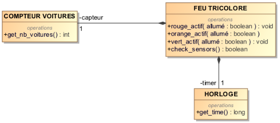
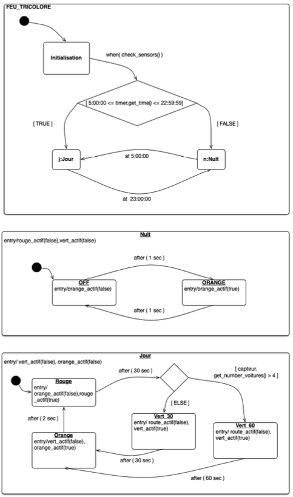
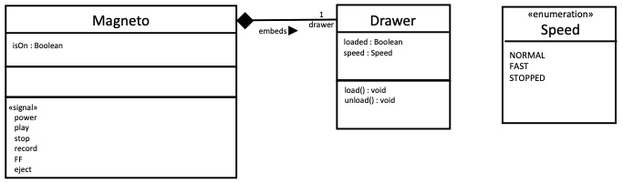
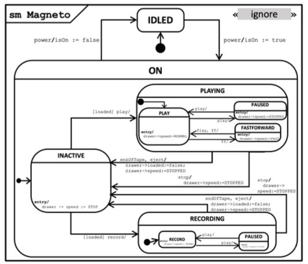

This chapter provides practical exercises to apply the concepts of UML State Machine Diagrams. Each exercise presents a problem description and a context (like a class diagram), followed by the task of modeling the dynamic behavior using a state machine.

### Exercise 1: Traffic Light System

**Problem:**
Model the behavior of a traffic light system located at the intersection of two major roads. The system controls three bulbs (red, orange, green), includes an internal clock, and a sensor to detect if at least 5 cars are waiting. The system operates in three modes: **Initialization**, **Day Mode**, and **Night Mode**.

* **Initialization:** Triggered on power-up. Checks sensors and bulbs. If okay, transitions to Day or Night mode based on the current time.
* **Day Mode:** Active from 05:00:00 to 22:59:59. Starts with Red for 30s. Red and Green lights normally last 30s each. However, if the sensor detects >= 5 cars just before switching to Green, the Green light lasts 60s instead. The transition from Green to Red includes a 2s Orange light.
* **Night Mode:** Active from 23:00:00 to 04:59:59. Triggered only when the Day mode is in the Red state at 23:00:00. The Orange light flashes (1s on, 1s off).
* **Transitions between Day/Night:** Switches to Night mode at 23:00:00 (if Red). Switches back to Day mode at 05:00:00.

**Context:** A simplified class diagram shows the `FEU TRICOLORE` (Traffic Light) interacting with `COMPTEUR VOITURES` (Car Counter) and `HORLOGE` (Clock).

{fig-alt="Class diagram showing Feu Tricolore, Compteur Voitures, and Horloge." width="70%" fig-align="center"}

**Task:**

1.  Model the traffic light's behavior using a UML State Machine Diagram.
2.  Modify the diagram to handle synchronization with an identical traffic light on the intersecting road: when one light goes from Green to Orange, the other goes from Red to Green. Document any assumptions made.

::: {.callout-tip collapse="true" title="Click to see the solution"}

{fig-alt="State machine diagram showing Initialization, Day, and Night composite states with substates for Red, Green, Orange, and flashing."}

**Correction Details :**

* **Top-Level States:** The machine starts in the `Initialisation` state. A transition with a guard `check_sensors()` leads to a choice point. Based on the time from `timer.get_time()`, it enters either the `Jour` (Day) or `Nuit` (Night) composite state.
* **Day Mode (`Jour`):** This is a composite state with substates `Rouge`, `Vert30`, `Vert60`, and `Orange`.
    * The initial state within `Jour` is `Rouge`. Entry action: `rouge_actif(true)`, turn off others.
    * Transition `Rouge` -> Choice Point: Triggered `after(30 sec)`.
    * Choice Point -> `Vert60`: Guard `[capteur.get_nb_voitures() > 4]`. Entry action: `vert_actif(true)`, turn off others.
    * Choice Point -> `Vert30`: Guard `[ELSE]`. Entry action: `vert_actif(true)`, turn off others.
    * Transition `Vert60` -> `Orange`: Triggered `after(60 sec)`. Entry action: `orange_actif(true)`, turn off others.
    * Transition `Vert30` -> `Orange`: Triggered `after(30 sec)`. Entry action: `orange_actif(true)`, turn off others.
    * Transition `Orange` -> `Rouge`: Triggered `after(2 sec)`. Entry action: `rouge_actif(true)`, turn off others.
* **Night Mode (`Nuit`):** This is a composite state modeling the flashing orange light.
    * It has two substates: `ORANGE` (light on) and `OFF` (light off).
    * Entry action for `Nuit`: turn off red and green.
    * Entry action for `ORANGE`: `orange_actif(true)`.
    * Entry action for `OFF`: `orange_actif(false)`.
    * Transitions between `ORANGE` and `OFF` are triggered `after(1 sec)` each.
* **Transitions Between Day/Night:**
    * `Jour` -> `Nuit`: Trigger `at(23:00:00)`. This transition should ideally originate from the `Rouge` state within `Jour` as specified.
    * `Nuit` -> `Jour`: Trigger `at(05:00:00)`.

**Key Concepts Illustrated:**

* **Composite States:** `Jour` and `Nuit` encapsulate specific modes of operation.
* **Substates:** Modeling the different light phases (Red, Green, Orange) within `Jour` and flashing within `Nuit`.
* **Transitions:** Showing changes between states based on time or conditions.
* **Triggers:** Using `after()` and `at()` for Time Events, `when()` for Change Events, and operation calls.
* **Guards:** Using conditions like time ranges or car count (`> 4`) to direct flow.
* **Entry Actions:** Defining behavior executed upon entering a state (e.g., activating a light bulb).
* **Choice Pseudostate:** Modeling conditional paths based on sensor reading.

:::

### Exercise 2: VCR (Magnetoscope)

**Problem:**
Model the behavior of a simplified VCR (Magnetoscope) using a State Machine Diagram. The VCR interacts with a `Drawer` (which holds the cassette) and has signals corresponding to button presses (`power`, `play`, `stop`, `record`, `FF`, `eject`).

* **Power:** `power` toggles the VCR between `IDLED` (standby, `isOn=false`) and `ON` (`isOn=true`).
* **Loading:** The `Drawer` class handles `load()`/`unload()` operations, reflected by its `loaded: Boolean` attribute.
* **ON State:** When ON, the VCR starts in an `INACTIVE` substate (cassette loaded, doing nothing).
    * From `INACTIVE`, `play` (if `loaded`) transitions to `PLAYING` state.
    * From `INACTIVE`, `record` (if `loaded`) transitions to `RECORDING` state.
    * `play` or `record` when not `loaded` have no effect.
* **PLAYING State:** This is a composite state.
    * Starts in `PLAY` substate (normal speed).
    * `play` toggles between `PLAY` and `PAUSED`.
    * `FF` (Fast Forward) from `PLAY` goes to `FASTFORWARD` state (speed `FAST`).
    * `FF` or `play` from `FASTFORWARD` returns to `PLAY` (speed `NORMAL`).
* **RECORDING State:** This is a composite state.
    * Starts in `RECORD` substate.
    * `play` toggles between `RECORD` and `PAUSED`.
    * `FF` is not available/ignored in `RECORDING`.
* **Stopping/Ejecting:**
    * `stop` from `PLAYING` or `RECORDING` transitions back to `INACTIVE` (cassette remains loaded, speed `STOPPED`).
    * `eject` from `PLAYING` or `RECORDING` transitions back to `INACTIVE`, unloads the cassette (`loaded=false`, speed `STOPPED`).
    * `endOfTape` (internal signal) during `PLAYING` or `RECORDING` automatically ejects the tape and returns to `INACTIVE`.

**Context:** A class diagram shows `Magneto` (VCR), `Drawer`, and an enumeration `Speed`. `Magneto` has an `isOn` attribute and lists signals like `power`, `play`, etc. `Drawer` has `loaded` and `speed` attributes and `load()`/`unload()` operations.

{fig-alt="Class diagram showing Magneto, Drawer, and Speed enumeration."}

**Task:**
1.  Complete the provided partial State Machine Diagram for the `Magneto` class.
2.  Describe the changes needed (in the class diagram and state machine) to add a `bkwd` (Backward/Rewind) button allowing reverse playback at normal and fast speeds.

::: {.callout-tip collapse="true" title="Click to see the solution (Part 1 - VCR Behavior)"}

{fig-alt="State machine diagram for the VCR showing IDLED, ON (with INACTIVE, PLAYING, RECORDING substates)."}

**Correction Details (Part 1):**

* **Top-Level States:** `IDLED` (initial) and `ON`. Transitions between them are triggered by `power`, setting `isOn` accordingly.
* **ON State (Composite):** Contains `INACTIVE`, `PLAYING`, and `RECORDING` substates. The initial state within `ON` is `INACTIVE`. Entry action for `INACTIVE` sets `drawer->speed := STOPPED`.
* **Transitions from INACTIVE:**
    * `play [loaded] /` leads to `PLAYING`'s initial state (`PLAY`).
    * `record [loaded] /` leads to `RECORDING`'s initial state (`RECORD`).
* **PLAYING State (Composite):** Contains `PLAY`, `PAUSED`, and `FASTFORWARD` substates.
    * Initial state is `PLAY`. Entry action: `drawer->speed := NORMAL`.
    * `PLAY` -> `PAUSED`: Trigger `play /`. Entry action: `drawer->speed := STOPPED`.
    * `PAUSED` -> `PLAY`: Trigger `play /`. Entry action: `drawer->speed := NORMAL`.
    * `PLAY` -> `FASTFORWARD`: Trigger `FF /`. Entry action: `drawer->speed := FAST`.
    * `FASTFORWARD` -> `PLAY`: Trigger `FF /` or `play /`. Entry action: `drawer->speed := NORMAL`.
* **RECORDING State (Composite):** Contains `RECORD` and `PAUSED` substates.
    * Initial state is `RECORD`.
    * `RECORD` -> `PAUSED`: Trigger `play /`.
    * `PAUSED` -> `RECORD`: Trigger `play /`.
* **Stop/Eject Transitions:**
    * From `PLAYING` (any substate) -> `INACTIVE`: Trigger `stop / drawer->speed := STOPPED`.
    * From `RECORDING` (any substate) -> `INACTIVE`: Trigger `stop / drawer->speed := STOPPED`.
    * From `PLAYING` (any substate) -> `INACTIVE`: Trigger `eject / drawer->loaded := false; drawer->speed := STOPPED`.
    * From `RECORDING` (any substate) -> `INACTIVE`: Trigger `eject / drawer->loaded := false; drawer->speed := STOPPED`.
* **End of Tape:**
    * From `PLAYING` -> `INACTIVE`: Trigger `endOfTape / drawer->loaded := false; drawer->speed := STOPPED`.
    * From `RECORDING` -> `INACTIVE`: Trigger `endOfTape / drawer->loaded := false; drawer->speed := STOPPED`.

**(Solution for Part 2 - Adding Rewind):**

* **Class Diagram Changes:** Add `REWIND_NORMAL` and `REWIND_FAST` literals to the `Speed` enumeration. Add a `bkwd` signal to the `Magneto` class.
* **State Machine Changes:** Add a `REWINDING` composite state parallel to `PLAYING` and `RECORDING` within `ON`. Add transitions from `INACTIVE` to `REWINDING` triggered by `bkwd [loaded]`. Inside `REWINDING`, add substates like `REWIND` (normal reverse) and `FASTREWIND`. Add transitions toggling between them triggered by `bkwd`. Add `stop` and `eject` transitions exiting `REWINDING` back to `INACTIVE`. Add an `endOfTape` transition from `REWINDING` as well.

**Key Concepts Illustrated:**

* **Nested Composite States:** Modeling different modes of operation (`ON`, `PLAYING`, `RECORDING`) with their own internal behaviors.
* **Event Handling:** Transitions triggered by button presses (signals) like `play`, `record`, `stop`, `FF`, `eject`, `power`.
* **Guards:** Using conditions like `[loaded]` to enable/disable transitions.
* **Entry Actions:** Setting attributes (`isOn`, `drawer->speed`, `drawer->loaded`) upon entering states or as effects of transitions.
* **Modeling Complex Lifecycles:** Capturing the intricate behavior of the VCR through states and transitions.

:::
