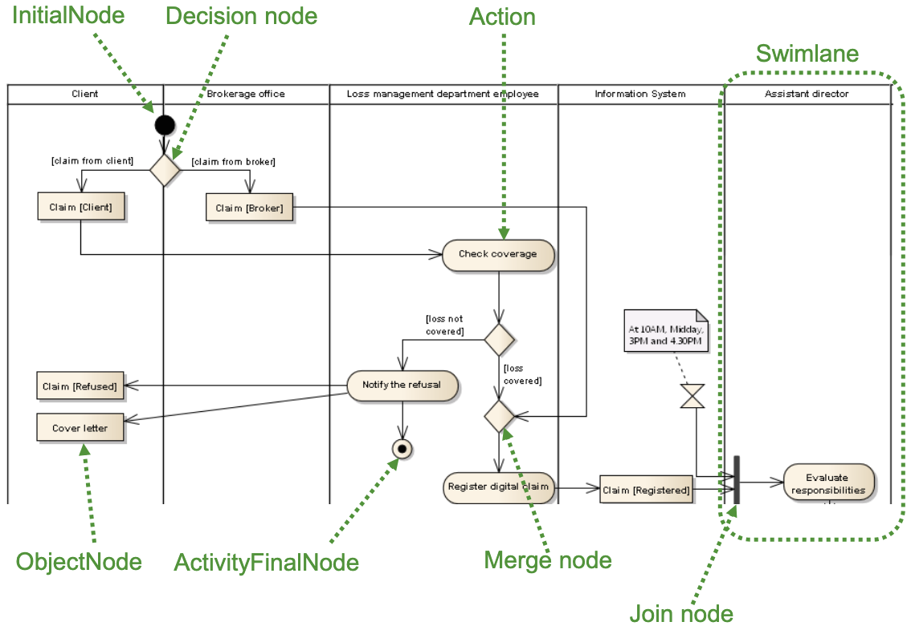
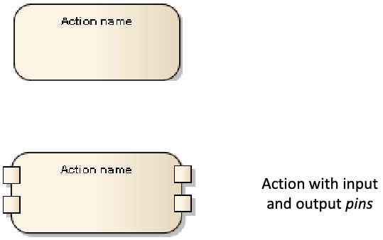
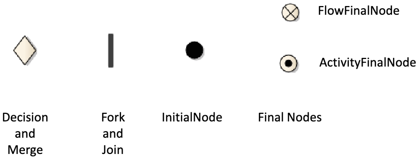
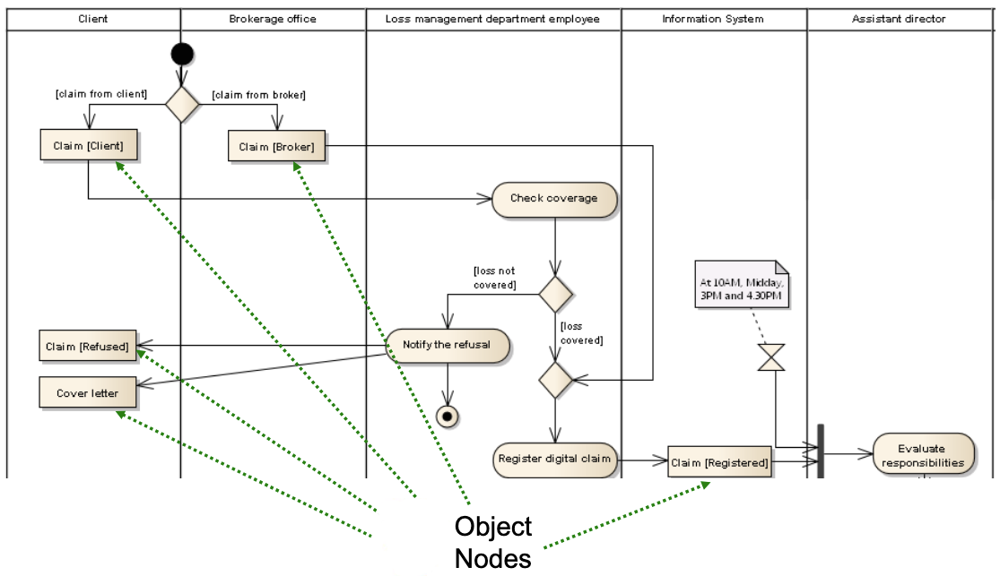
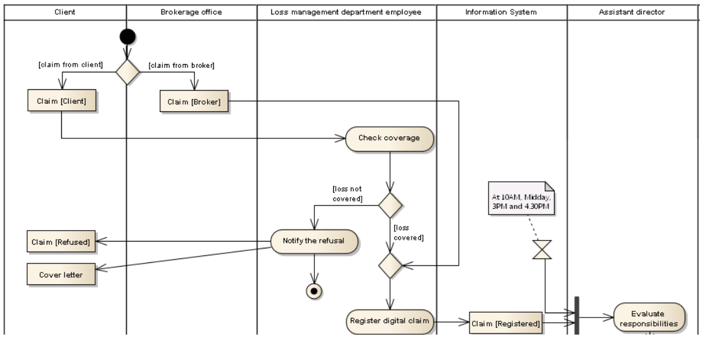
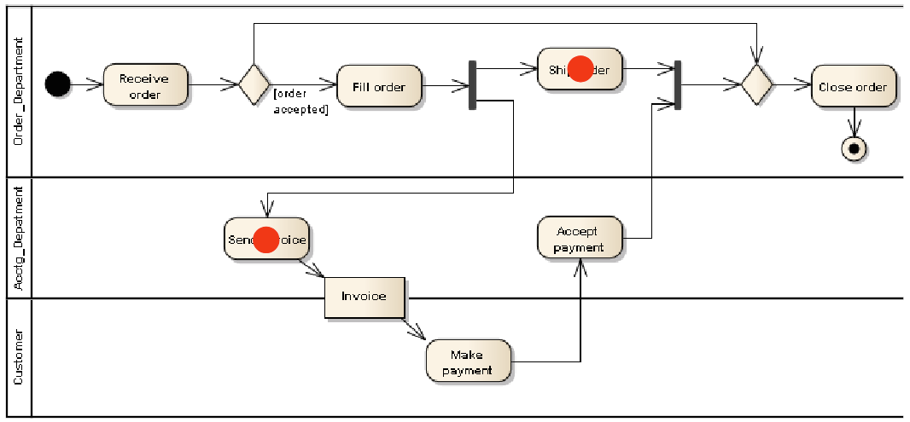

This chapter explores another crucial behavioral diagram in UML: the **Activity Diagram**. While State Machine diagrams focus on the lifecycle of a single object, Activity Diagrams excel at modeling workflows, processes, and algorithms, showing the flow of control and data between various steps.

## What is an Activity Diagram?

An Activity Diagram models the **dynamics** of a system by representing the flow of activities. It can depict high-level business processes (workflows involving multiple actors or departments) or detailed low-level logic (like the steps within a complex algorithm).

Its main purpose is to show:

* The sequence of **steps** (actions) involved in a process.
* **Precedence** (sequencing) and **concurrence** (parallelism) between these steps.
* Optionally, **who** or **what part** of the system is responsible for performing each step.
* Optionally, the **data or objects** that are created, used, or modified during the activity.

Activity diagrams are versatile and can be used for:

* Modeling and analyzing business processes (understanding workflows, identifying bottlenecks, re-engineering).
* Detailing complex use case scenarios.
* Modeling the logic of an operation or algorithm.

## Core Concepts: Nodes, Edges, and Partitions

Activity Diagrams are essentially flowcharts built from specific UML elements.

{fig-alt="Overview of an Activity Diagram illustrating its main components." width="100%"}

The main building blocks are:

* **Nodes:** Represent steps or control points in the flow. There are three main types:

    * **Action Nodes:** Represent the execution of a specific task or step.
    * **Control Nodes:** Direct the flow (start, end, decisions, merges, parallel forks, joins).
    * **Object Nodes:** Represent data or objects flowing through the activity.
* **Edges:** Connect the nodes, showing the path of control or data. There are two main types:
    * **Control Flow Edges:** Show the sequence between actions.
    * **Object Flow Edges:** Show the flow of objects/data between actions.
* **Activity Partitions (Swimlanes):** Optional mechanism to group actions based on responsibility (e.g., by actor, department, system component).

Let's look at each component in more detail.

## Action Nodes

An **Action** is the fundamental unit of behaviour in an activity diagram. It represents a single step or task that needs to be performed. Actions are typically atomic, meaning they are considered indivisible units of work within the context of the diagram's abstraction level.

**Notation:** Actions are represented by rectangles with rounded corners, containing the name or description of the action.

{fig-alt="A round-cornered rectangle representing a UML Action Node." width="40%" fig-align="center"}

Actions can model a wide variety of tasks:

* Manual or automated steps in a process (e.g., `Check coverage`, `Register digital claim`).
* Creating, reading, updating, or deleting data/objects (CRUD operations).
* Invoking operations on objects.
* Calling other behaviors (like sub-activities or state machines).
* Sending or receiving signals/messages.
* Performing calculations.

## Control Nodes

Control nodes manage the flow of execution within the activity. They don't represent tasks themselves but direct the sequence and concurrency of actions.

{fig-alt="Symbols for Initial, Final, Decision, Merge, Fork, and Join nodes." width="80%" fig-align="center"}

* **Initial Node:** (Solid circle) Marks the starting point of the activity. An activity typically has only one initial node.
* **Final Nodes:** Indicate the termination of a flow.
    * **Activity Final Node:** (Circled solid circle / bullseye) Terminates the *entire* activity, stopping all concurrent flows within it.
    * **Flow Final Node:** (Circled X) Terminates only the *specific flow* reaching it; other concurrent flows may continue.
* **Decision Node:** (Diamond) Represents a conditional branch point (like an `if` statement). It has one incoming edge and multiple outgoing edges, each labeled with a **guard condition** (e.g., `[loss covered]`). Only one outgoing path is taken based on which guard evaluates to true.
* **Merge Node:** (Diamond) Merges multiple alternative flows back into one. It has multiple incoming edges and one outgoing edge. It passes through any token arriving on any incoming edge (no synchronization). It's the counterpart to a Decision Node.
* **Fork Node:** (Thick bar) Splits a single flow into multiple concurrent (parallel) flows. It has one incoming edge and multiple outgoing edges. A token arriving at a fork is duplicated across all outgoing edges, initiating parallel execution.
* **Join Node:** (Thick bar) Synchronizes multiple concurrent flows. It has multiple incoming edges and one outgoing edge. It waits for tokens to arrive on *all* incoming edges before allowing a single token to proceed on the outgoing edge. It's the counterpart to a Fork Node.

## Object Nodes and Object Flows

While Control Nodes and Control Flows manage the sequence of actions, **Object Nodes** and **Object Flows** manage the data and objects that are used or produced by actions.

**Notation:** Object Nodes are represented by rectangles. They can show the object's name, its class, and optionally its state in square brackets (e.g., `Claim [Registered]`).

{fig-alt="Various ways to depict Object Nodes in UML Activity Diagrams." width="90%" fig-align="center"}

* **Object Node:** Represents an object or a set of objects that are involved in the activity flow. They often act as buffers holding the output of one action until it's consumed by the next.
* **Pins:** Object Nodes can also appear as small squares attached to an Action Node, called **Input Pins** (receiving data) and **Output Pins** (producing data). This notation visually links the data directly to the action that uses or creates it.
* **Object Flow Edge:** (Solid arrow) Connects an output pin/object node to an input pin/object node, indicating that the object/data produced by the source is available to the target.

Object Flows allow modeling data dependencies: an action requiring an object as input cannot start until that object is available via an incoming Object Flow edge.

## Activity Partitions (Swimlanes)

Activity Partitions, often called **Swimlanes**, are used to organize the actions within an activity diagram based on who or what is responsible for performing them. Partitions can represent:
* Actors (e.g., `Client`, `Assistant director`)
* Organizational units (e.g., `Brokerage office`, `Loss management department`)
* System components (e.g., `Information System`)

**Notation:** Swimlanes are shown as visual regions (columns or rows) separated by solid lines. Each partition is labeled with the name of the responsible party. Actions are placed within the lane corresponding to their performer.

{fig-alt="Activity Diagram organized with vertical swimlanes." width="100%"}

Swimlanes improve readability by clearly showing the distribution of tasks. They can also be nested hierarchically (e.g., a `Sales Department` lane containing sub-lanes for `Pre-Sales` and `Post-Sales`).

## Semantics: Token Flow

The execution semantics of an Activity Diagram are often explained using the concept of **tokens**.

* A **token** represents a thread of control (for Control Flows) or a piece of data/object (for Object Flows).
* Execution starts when a token is placed on the **Initial Node**.
* Tokens flow along edges from node to node.
* An **Action** can start only when tokens are available on *all* its incoming edges (implicit join). When an action finishes, it places tokens on *all* its outgoing edges (implicit fork).
* **Control Nodes** manipulate tokens according to their rules (e.g., a Decision Node passes the token to only one outgoing edge based on guards; a Fork Node duplicates the token onto all outgoing edges).
* The activity finishes when all tokens are consumed by Final Nodes or destroyed (e.g., by reaching a Flow Final Node).

{fig-alt="Diagrams showing tokens moving through actions, forks, joins, and decisions." width="100%"}

Understanding token flow helps visualize how sequences, choices, and parallelism work within the diagram.

## Advanced Constructs

Activity Diagrams offer several advanced features for modeling more complex scenarios:

* **Pre/Post-conditions:** Can be specified for the entire activity or locally for specific actions.
* **Sub-activity Invocation (Call Behavior Action):** An action that invokes another, separate Activity Diagram, allowing for modularity and reuse. Represented by an action node with a rake symbol (Ψ).
* **Send Signal / Accept Event Actions:** Actions used for explicit communication between activities or with objects outside the activity (asynchronous messaging).
* **Interruptible Activity Regions:** A region within the diagram where all executing flows can be abruptly terminated if a specific event occurs (e.g., a `Cancel request`).
* **Expansion Regions:** A structured region representing a loop that executes its internal logic once for each item in an input collection (like a `for-each` loop).
* **Connectors:** Named circles used to break long edge paths and improve diagram layout, connecting two parts of the diagram without drawing a long line.

## Conclusion

Activity Diagrams are a powerful tool for modeling processes and workflows. They clearly depict the sequence of actions, conditional logic, parallelism, responsibilities (via swimlanes), and data flow. While their semantics can sometimes be complex, especially with advanced features, they provide a valuable visual language for analyzing, designing, and communicating system behaviour. They share similarities with BPMN (Business Process Model and Notation) but are integrated within the broader UML ecosystem, making them particularly useful for software engineers modeling system logic or detailed use case flows.