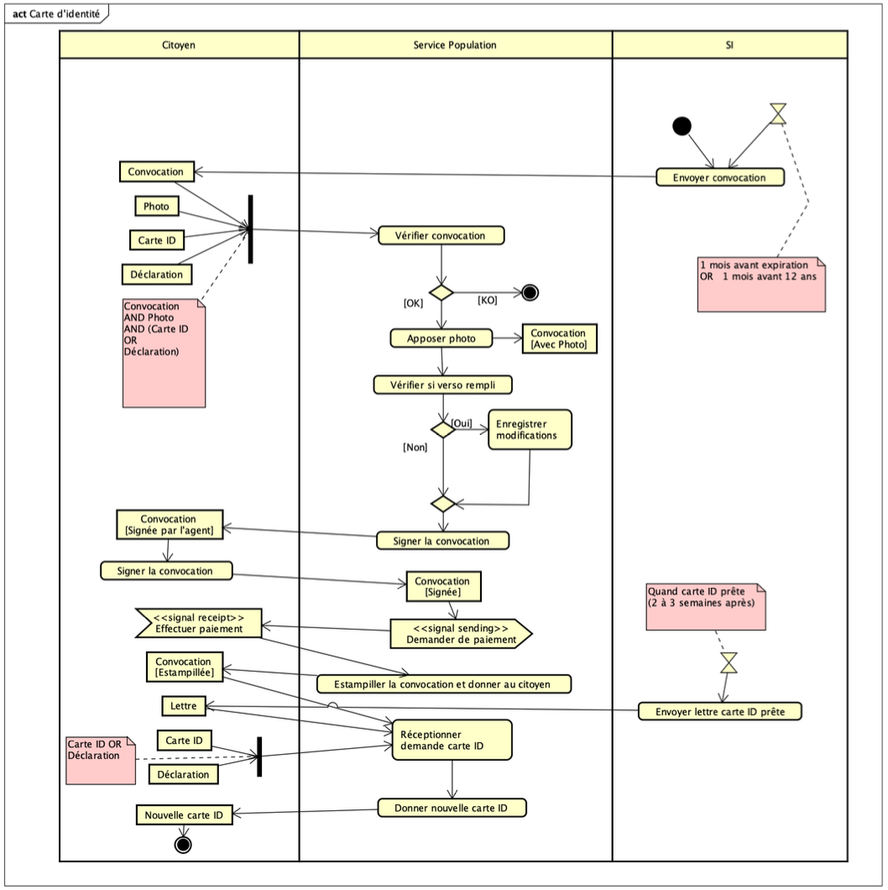
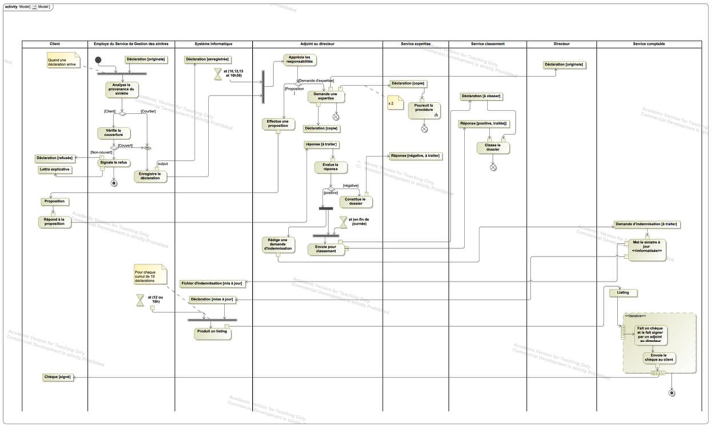

This chapter presents practical exercises focused on UML Activity Diagrams. The goal is to apply the concepts learned to model real-world processes and workflows, paying attention to actions, control flow, object flow, and responsibilities.

### Exercise 1: ID Card Renewal Process

**Problem:**
Model the process for renewing a Belgian ID card, based on the following description:

Belgian citizens receive an ID card at age 12 and must carry it from age 15. One month before the card expires (or one month before turning 12), a convocation letter is sent to the person's home. The back of the letter allows indicating errors or requesting special status mentions.

From the date on the letter, the person must go to the population service of their municipality with:

* The convocation letter.
* A recent ID photo meeting specific criteria.
* Their current ID card (or a police report if lost/stolen/damaged).

A municipal officer checks the convocation data and affixes the photo. If the back was filled out, the officer makes the necessary modifications. Both the applicant and the officer sign the document. The officer requests payment (X euros, cash or card). After payment, the left part of the convocation is stamped "paid" and returned to the applicant. The officer then processes the ID card request.

Two to three weeks later, a letter is sent informing the person that the new ID card is ready. To collect the new card, the person must return their old ID card (or the police replacement certificate). The officer then gives them the new ID card.

**Task:**
Construct the Activity Diagram for the ID card renewal process described above.

::: {.callout-tip collapse="true" title="Click to see the solution"}

{fig-alt="Activity diagram showing swimlanes for Citizen, Population Service, and Information System, detailing the ID card renewal steps."}

**Correction Details:**

The diagram models the workflow using three swimlanes: **Citoyen** (Citizen), **Service Population** (Population Service), and **SI** (Information System).

* **Initiation (SI):** The process starts in the SI lane with an action `Envoyer convocation` (Send Convocation), triggered implicitly (e.g., 1 month before expiration or age 12). An initial node leads to this action.
* **Citizen Preparation:** The Citizen receives the `Convocation` (Object Node). They then gather the required items (`Photo`, `Carte ID` or `Déclaration` [Police Report]). A Fork node shows these items are needed concurrently before proceeding.
* **At the Population Service:**
    * The Citizen presents the documents (Fork synchronizes inputs).
    * `Vérifier convocation` (Verify Convocation): The officer checks the documents.
    * Decision Node: Based on verification (`[OK]` or `[KO]`). The `[KO]` path leads to a Flow Final node (process stops for this flow).
    * `Apposer photo` (Affix Photo): If OK, the photo is added. Output: `Convocation [Avec Photo]`.
    * `Vérifier si verso rempli` (Check if back is filled): Another decision.
    * `Enregistrer modifications` (Register Modifications): If `[Oui]` (Yes), changes are recorded.
    * Merge Node: Flows merge after the modification check.
    * `Signer la convocation` (Sign the Convocation): Action performed by the officer. Output: `Convocation [Signée par l'agent]`.
    * `Signer la convocation` (Sign the Convocation): Action performed by the Citizen. Input: `Convocation [Signée par l'agent]`. Output: `Convocation [Signée]`.
    * `Demander de paiement` (Request Payment): Officer asks for payment (Send Signal Action `<<signal sending>>`).
    * `Effectuer paiement` (Make Payment): Citizen pays (Receive Signal Action `<<signal receipt>>`).
    * `Estampiller la convocation et donner au citoyen` (Stamp convocation and give to citizen): Officer returns the paid part. Output: `Convocation [Estampillée]`.
    * `Réceptionner demande carte ID` (Receive ID Card Request): Officer formally processes the application in the system.
* **Card Production (SI):** An Accept Time Event node (`Quand carte ID prête (2 à 3 semaines après)`) triggers the `Envoyer lettre carte ID prête` (Send ID ready letter) action.
* **Card Collection:**
    * The Citizen receives the `Lettre` (Letter). They bring their `Carte ID` or `Déclaration`.
    * Fork node synchronizes the old card/declaration input.
    * `Donner nouvelle carte ID` (Give New ID Card): The officer exchanges the old card/doc for the `Nouvelle carte ID` (New ID Card - Object Node).
    * The process ends with an Activity Final Node after the Citizen receives the new card.

**Key Concepts Illustrated:**

* **Swimlanes:** Clearly delineating responsibilities between the Citizen, Population Service, and Information System.
* **Actions:** Modeling individual steps like verifying documents, signing, paying, sending letters.
* **Object Nodes:** Representing documents and data flowing through the process (Convocation, Photo, Card, Letter) and showing their states (e.g., `[Signée]`, `[Estampillée]`).
* **Control Nodes:** Using Initial/Final nodes, Forks (for gathering documents/returning old card), Decisions (verification, modifications), Merges.
* **Signals:** Modeling the payment interaction (`<<signal sending>>`, `<<signal receipt>>`).
* **Time Events:** Representing the delay before the card is ready.

:::

### Exercise 2: Insurance Claim Management

**Problem:**
Model the claim management process of an insurance company based on the following description:

Claim declarations can come directly from the insured person (Client) or through a brokerage office (Broker).

* **Client Claim:** Handled by a loss management department employee.
    * The employee checks coverage using the Information System (SI).
    * If not covered, the declaration is returned to the client with an explanation letter.
    * If covered, the employee registers the claim in the SI.
* **Broker Claim:** Assumed to be verified by the broker; registered directly in the SI by the employee.
* **Assistant Director's Role:** Registered claims are processed by an assistant director at specific times (10h, 12h, 15h, 16h30).
    * The assistant analyzes the claim and decides whether to indemnify the client directly or involve the expert service.
    * **Indemnification:** Sends a proposal letter to the client.
        * If the client accepts (favorable response), sends an indemnification request to the financial service and archives the claim declaration + client response via the classification department at the end of the day.
        * If the client rejects (unfavorable response), creates a file (declaration + client letter) and sends it to the expert service.
    * **Expert Service:** Makes 3 copies of the declaration: one for the assistant, one original for the director, two for the expert service.
* **Financial Service's Role:** An employee processes indemnification requests.
    * Updates the SI with the paid amount. This also updates a file of indemnifications to be made.
    * An automated process runs at 12h and 16h, OR after 10 indemnification operations are registered. This process generates a listing of amounts due per client and archives the file content.
    * Based on the listing, a finance employee writes corresponding checks.
    * Checks are sent to the assistant director for signature.
    * Signed checks are sent to the clients.

**Task:**
Construct the Activity Diagram for the insurance company's claim management process.

::: {.callout-tip collapse="true" title="Click to see the solution"}

{fig-alt="Activity diagram with multiple swimlanes detailing the insurance claim process from reception to payment or expert involvement."}

**Correction Details:**

The diagram uses multiple swimlanes representing the different actors and departments involved: **Client**, **Brokerage office**, **Loss management department employee**, **Information System**, **Assistant director**, **Financial service employee**, **Expert service**, **Classification department**, **Director**.

*(Note: The diagram provided in the PDF is complex and serves as a detailed example. A full textual description would be very long. Key flows are highlighted below.)*

* **Claim Reception:** Starts with two potential paths (Client or Broker). A Merge node combines these paths before `Check coverage` *if* the claim is from the Client. Broker claims bypass the check.
* **Coverage Check:** Decision node after `Check coverage`. `[loss not covered]` leads to `Notify the refusal` and ends the flow for the client. `[loss covered]` leads to `Register digital claim`.
* **Registration:** Broker claims lead directly to `Register digital claim` in the SI lane. Output: `Claim [Registered]`.
* **Assistant Director Processing:** An Accept Time Event (`At 10h, 12h, 15h, 16h30`) triggers the `Evaluate responsibilities` action using the `Claim [Registered]` object.
    * Decision: Indemnify or Expertise required.
* **Indemnification Path:**
    * `Send Proposal` to Client.
    * Wait for `Response` (Accept Event Action).
    * Decision based on `Response`. `[positive answer]` leads to `Send Indemnification Request` (to Finance) and `Archive claim` (via Classification). `[negative answer]` leads to the Expertise path.
* **Expertise Path:** Involves actions like `Compile file`, `Send for classification` (potentially incorrect term, likely means send copies), distributing copies to Director, Expert Service.
* **Financial Service Path:**
    * Receives `Indemnification request [To handle]`.
    * `Update` SI.
    * Automated processing triggered by time or count (`At 12h, 16h or count=10`).
    * `Produce listing`.
    * `Write cheque`.
    * `Sign & Send` (by Assistant Director).
    * Final output `Cheque [Signed]` sent to Client.

**Key Concepts Illustrated:**

* **Extensive Use of Swimlanes:** Essential for clarifying responsibilities in a complex multi-department process.
* **Detailed Workflow:** Modeling sequences, decisions, and parallel paths (implied by distribution of copies).
* **Object States:** Using states like `[Registered]`, `[To handle]`, `[Signed]` to track the status of key objects (Claim, Request, Cheque).
* **Time and Event Triggers:** Using specific times and event counts (`10 operations`) to trigger parts of the process.
* **Data Stores:** Implicitly represented by archiving actions (`Archive claim`, potentially `Claim file` although notation differs).
* **Complexity Management:** Demonstrates how Activity Diagrams can visualize intricate business processes involving many actors and conditions.

:::
