This chapter dives into the UML diagrams that model **dynamic behavior**. While Class Diagrams show the static *structure* of a system, **Interaction Diagrams** show how objects *collaborate* over time. We will focus on the most common type, the **Sequence Diagram**, exploring its basic components and the advanced fragments used to model complex scenarios. We will also briefly cover the other three types of interaction diagrams: Communication, Interaction Overview, and Timing diagrams.

## Overview of Interaction Diagrams

Interaction Diagrams are used to model the system's runtime evolution for a particular scenario (e.g., a single path through a use case). Their primary purpose is to visualize the **sequence of messages** or events exchanged between different objects.

While State Machines model "all stories for one object" and Activity Diagrams model "some stories for some objects," Interaction Diagrams model **"one story for all involved objects."**

UML defines four types of Interaction Diagrams, each with a different focus:

* **Sequence Diagram:** Emphasizes the *temporal order* of messages.
* **Communication Diagram:** Emphasizes the *structural links* between objects.
* **Interaction Overview Diagram:** Shows the *high-level flow* between different interactions.
* **Timing Diagram:** Focuses on *precise time constraints* and state changes.

## Sequence Diagrams: Modeling Scenarios

The **Sequence Diagram** is the most frequently used interaction diagram. It provides an intuitive way to visualize a scenario, making it an excellent tool for analysis, design, and documentation.

It is organized along two axes:

* **Horizontal Axis:** Represents the different objects (or participants) in the interaction.
* **Vertical Axis:** Represents **time**, which flows from top to bottom.

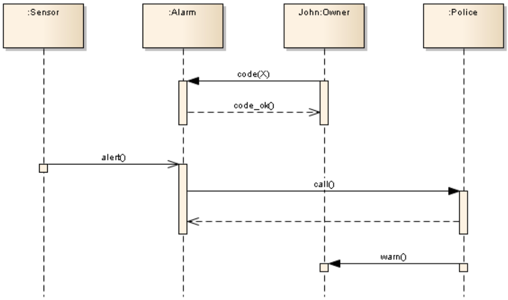{fig-alt="A simple sequence diagram with lifelines and messages." width="80%" fig-align="center"}

## The Anatomy of a Sequence Diagram

A sequence diagram is built from a few core components that together tell a complete story.

### Lifelines
A **Lifeline** represents a single participant in the interaction. It consists of:

* **Head:** A rectangle at the top, which names the participant. The format is `objectName:ClassName`, such as `John:Owner` or `:Alarm` for an anonymous object.
* **Stem:** A vertical dashed line that represents the object's lifetime during this specific scenario.

### Messages: The Core of Interaction
A **Message** is the communication between two lifelines, shown as a horizontal arrow. The type of arrowhead is critical and defines the nature of the communication.

* **Synchronous Message (Call):** A solid line with a **filled arrowhead**. This represents a standard operation call. The sender is *blocked* (waits) until the receiver finishes processing the message and returns a reply.
* **Reply Message:** A dashed line with an **open arrowhead**. This shows the return of control (and data) from a synchronous message.
* **Asynchronous Message:** A solid line with an **open arrowhead**. The sender sends the message and *immediately* continues with its own execution, without waiting for a reply. This is common for event-based systems or signals.
* **Object Creation:** A message (often named `create()` or `<<create>>`) that points to the *head* of a lifeline. This shows that the object is created at this point in time.
* **Object Destruction:** A large **X** at the end of a lifeline's stem, often initiated by a `<<destroy>>` message from another object. This indicates the object is removed from the system.

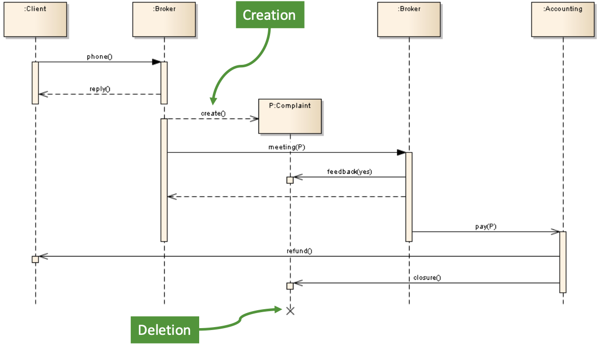{fig-alt="Visual notation for different UML message types." width="100%"}

### Execution Specifications (Activation Bars)
An **Execution Specification** (or "activation bar") is the thin, tall rectangle shown on a lifeline's stem. It visualizes the period during which an object is "active" or "busy" (either executing its own code or waiting for a reply from another object it called).

## Advanced Scenarios: Combined Fragments

Real-world scenarios are not just simple, linear sequences. They involve loops, conditions, and exceptions. To model this, sequence diagrams use **Combined Fragments**, which are drawn as a box enclosing a portion of the interaction. A label in the top-left corner, called an **operator**, defines the fragment's logic.

### `alt` (Alternative)
The `alt` fragment models a conditional "if-then-else" structure. The box is divided into sections by dashed lines, each section (called an "operand") has a guard condition in square brackets. Only the operand whose guard is `true` will be executed.

::: {.callout-note icon="true" title="Fragment: alt"}
**`alt` (Alternative):** Used for conditional logic. Only the operand whose guard condition evaluates to true is executed. An optional `[else]` guard can be used for the default case.
:::

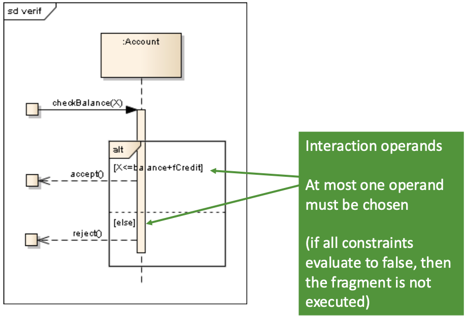{fig-alt="A sequence diagram using combined fragments for loop and alternative logic." width="80%"}

### `opt` (Optional)
The `opt` fragment is a simplified `alt` with only one operand. It models an "if-then" block. The interaction inside the box only happens if the guard condition is `true`.

::: {.callout-note icon="true" title="Fragment: opt"}
**`opt` (Optional):** The fragment is executed only if its guard condition is true. If false, the fragment is skipped.
:::

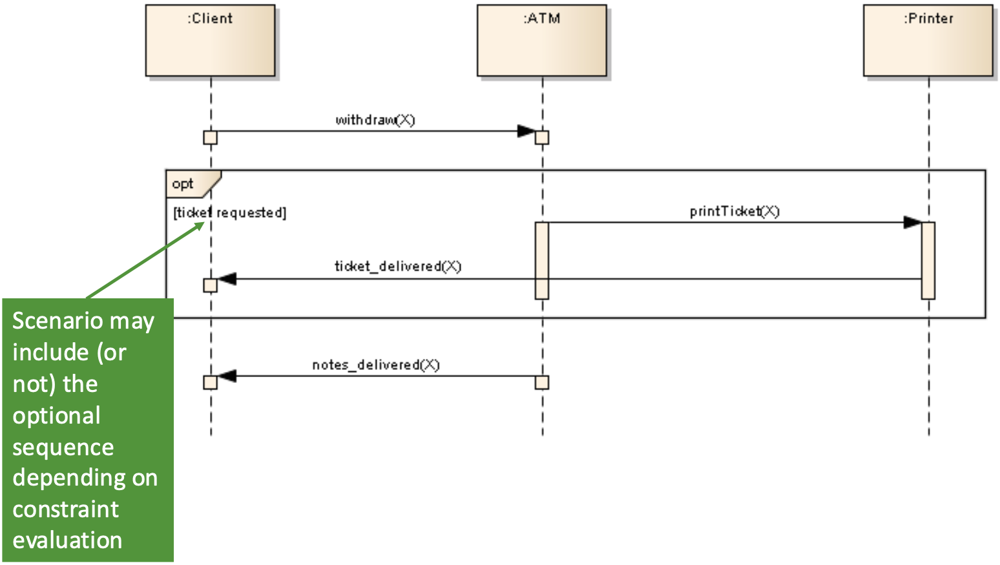{fig-alt="A sequence diagram using combined fragments for loop and alternative logic." width="80%"}

### `loop` (Iteration)
The `loop` fragment indicates that the sequence inside the box will be repeated. You can specify constraints on the loop, such as `loop (1..3)` (for 1 to 3 attempts) or `loop [PIN incorrect]` (loop as long as the PIN is incorrect).

::: {.callout-note icon="true" title="Fragment: loop"}
**`loop` (Iteration):** The sequence inside the fragment is repeated. A guard can specify the condition for looping or the number of iterations.
:::

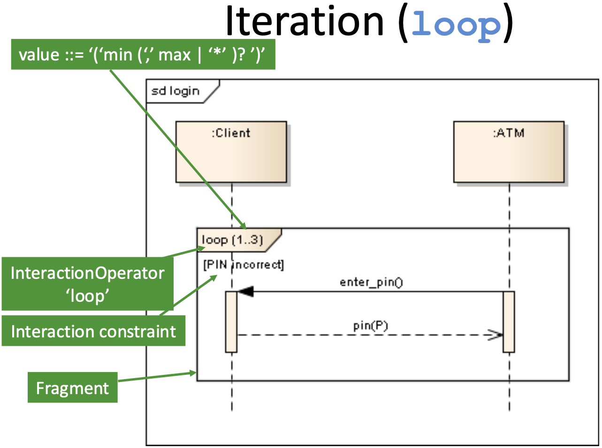{fig-alt="A sequence diagram using combined fragments for loop and alternative logic." width="80%"}

sequence-diagram-Optfragments

### Other Common Fragments

#### `ref` (Reference)
The `ref` fragment (or InteractionUse) acts like a function call for your diagrams. It creates a "window" that **references** another, separate sequence diagram. This is essential for modularity, allowing you to break down a very complex interaction (like a full "login" process) into its own diagram and then just `ref` it wherever it's used.

::: {.callout-note icon="true" title="Fragment: ref"}
**`ref` (Reference):** Allows a sequence diagram to include (or "call") another sequence diagram. It is used to break down complex interactions into smaller, reusable parts.
:::

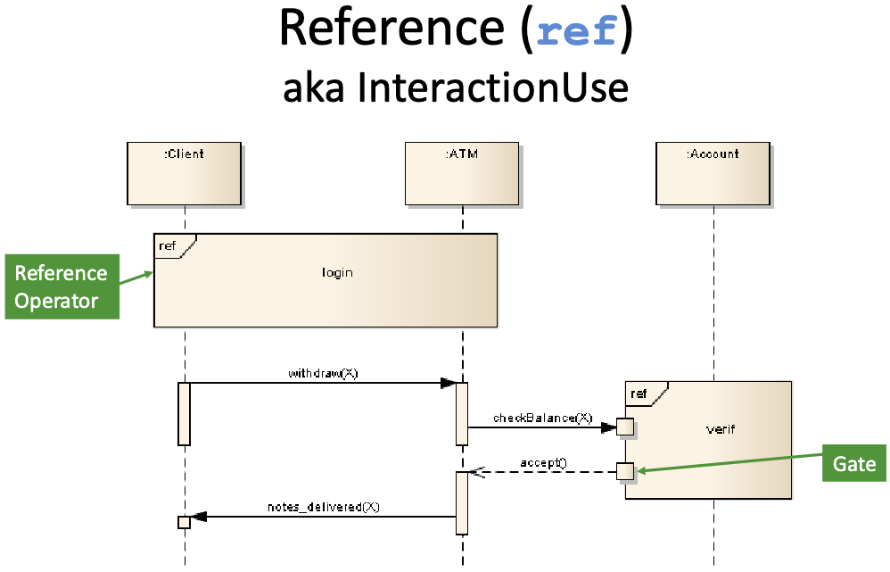{fig-alt="A sequence diagram using a 'ref' fragment to include a separate login interaction." width="80%"}

#### `par` (Parallel)
The `par` fragment indicates that the enclosed interactions are happening **concurrently**. The fragment box is divided into multiple operands (compartments) separated by dashed lines. The event sequences in each operand can execute in parallel, meaning their traces can be interleaved in any order, as long as the internal order of each individual operand is respected.

::: {.callout-note icon="true" title="Fragment: par"}
**`par` (Parallel):** The sequences in the different operands (compartments) of the fragment are executed concurrently.
:::

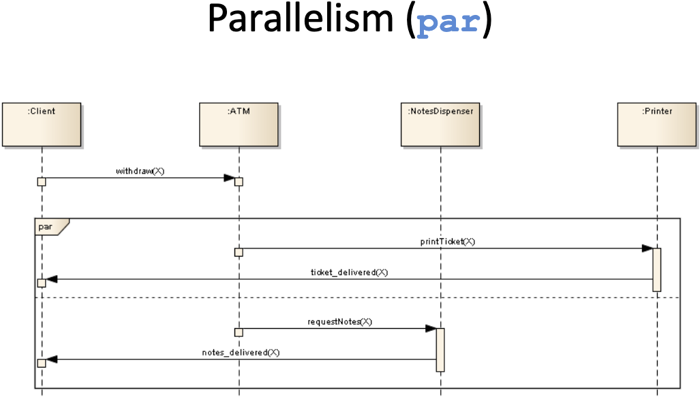{fig-alt="A sequence diagram using a 'par' fragment to model parallel operations." width="80%"}

#### `break` (Break)
The `break` fragment models an **exception** or a break in the normal flow. It almost always has a guard condition (e.g., `[PIN incorrect]`). If the guard evaluates to `true`, the sequence inside the `break` fragment is executed, and then the rest of the enclosing interaction (or fragment) is **skipped**. It's the equivalent of a `break` in a programming loop.

::: {.callout-note icon="true" title="Fragment: break"}
**`break` (Break):** Models an exception. If the fragment's guard is true, the fragment's sequence is executed, and the rest of the enclosing interaction is skipped.
:::

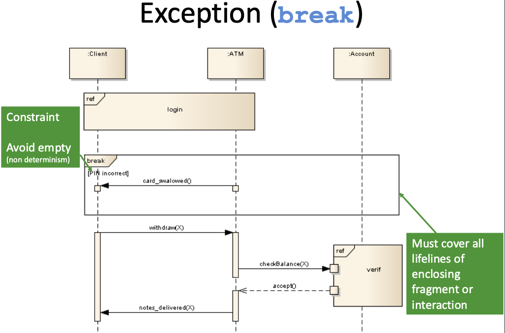{fig-alt="A sequence diagram using a 'break' fragment to model an exception flow." width="80%"}

#### `neg` (Negative)
The `neg` fragment specifies an **invalid** or **forbidden** sequence of events. It describes an "anti-scenario"—something that *must not* happen for the model to be valid. For example, you could use a `neg` fragment with the guard `[PIN incorrect]` to show a sequence where `withdraw(X)` is followed by `notes_delivered(X)`, indicating this specific trace is explicitly forbidden.

::: {.callout-note icon="true" title="Fragment: neg"}
**`neg` (Negative):** Specifies an "anti-scenario," or a sequence of events that is explicitly forbidden and must not occur.
:::

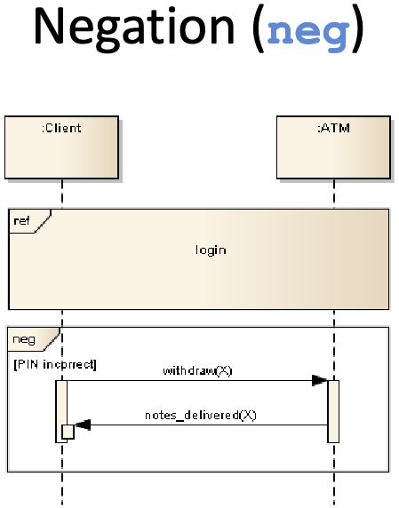{fig-alt="A sequence diagram using a 'neg' fragment to model a forbidden scenario." width="45%"}

#### `assert` (Assertion)
The `assert` fragment designates a sequence of events as the **only** valid continuation of the interaction. It is used to state that, given the state at the beginning of the fragment, the sequence of events shown inside *must* occur. Any other sequence at that point is considered an invalid trace. It's often used to check for critical, expected outcomes, like ensuring notes are delivered *only if* the PIN is correct and funds are sufficient.

::: {.callout-note icon="true" title="Fragment: assert"}
**`assert` (Assertion):** Specifies that the sequence within the fragment is the only valid continuation. Any other behavior at this point is considered invalid.
:::

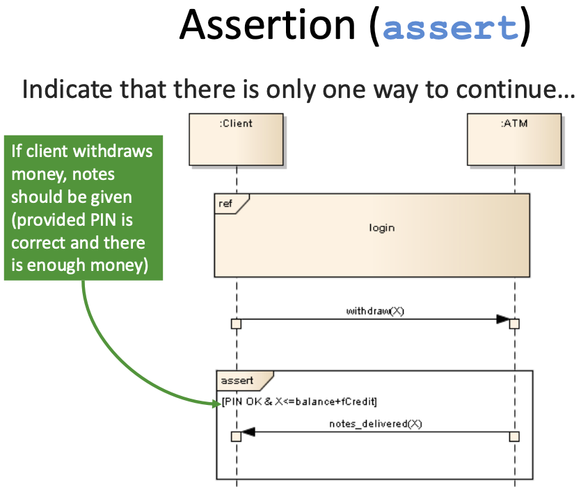{fig-alt="A sequence diagram using an 'assert' fragment to validate an interaction." width="80%"}

#### `strict` (Strict Sequencing)
By default, sequence diagrams have a 'partial ordering' where events on different lifelines are not strictly ordered unless causally linked by a message. The `strict` fragment overrides this. Inside a `strict` fragment, all event occurrences are forced into a single, strict sequence based *only* on their vertical position, regardless of which lifeline they are on. This ensures that the event at the top happens before the event just below it, even if they are on different lifelines.

::: {.callout-note icon="true" title="Fragment: strict"}
**`strict` (Strict Sequencing):** Enforces a strict top-to-bottom order for *all* event occurrences within the fragment, even across different lifelines.
:::

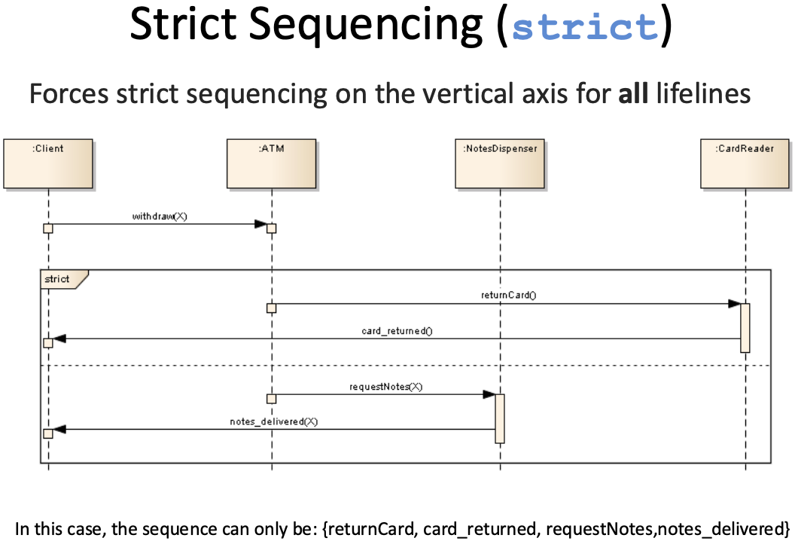{fig-alt="A sequence diagram using a 'strict' fragment." width="80%"}

#### `seq` (Weak Sequencing)
[cite_start]The `seq` fragment is used to model 'weak sequencing'. [cite_start]This is the default ordering for combined fragments. Unlike `strict`, `seq` does not enforce a total top-to-bottom order across all lifelines. [cite_start]It states that the operands must be executed in sequence, but it allows a "parallel merge" for operands that are on different sets of participants. The order of events on any *single* lifeline must be maintained, but events on different lifelines can be interleaved.

::: {.callout-note icon="true" title="Fragment: seq"}
**`seq` (Weak Sequencing):** Defines a sequence of operands. [cite_start]The order of events within any single lifeline is maintained, but events on different lifelines can be interleaved (a 'parallel merge').
:::

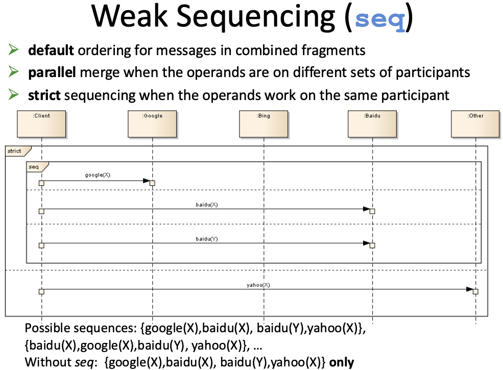{fig-alt="A sequence diagram using a 'seq' fragment." width="80%"}

## Semantics: Ordering and Time

It is critical to understand that the vertical axis in a sequence diagram represents **sequence (order), not linear time**. A large gap between two messages does not necessarily mean a long delay.

This leads to the concept of **Partial Ordering**.

* Events on a *single* lifeline are strictly ordered from top to bottom.
* Events on *different* lifelines are **not ordered** relative to each other, *unless* they are causally linked by a message.

For example, if `SanGoKu` sends a message to `Freezer`, and `SanGoHan` sends a message to `BooBoo`, there is no way to know which attack happens first. Both `(attack1, attack2)` and `(attack2, attack1)` are valid traces. If you *must* enforce that one event happens before another (e.g., SanGoHan can only attack after SanGoKu), you must use a `GeneralOrdering` construct or a coordinating message.

## Other Interaction Diagrams

While Sequence Diagrams are the most common, the other three types provide different, valuable perspectives.

### Interaction Overview Diagrams
This is a high-level diagram that orchestrates other interactions. It has the look and feel of an **Activity Diagram**, but its nodes are not simple actions; they are **`ref`** fragments that point to other, more detailed Sequence Diagrams. It's the best way to show the "big picture" of how different scenarios (like `login`, `withdraw`, `checkBalance`) are connected by decisions and loops.

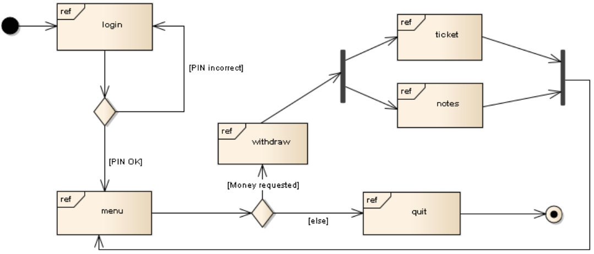{fig-alt="An Interaction Overview Diagram showing a high-level process flow." width="80%"}

### Communication Diagrams
This diagram (formerly "collaboration diagram") emphasizes the **structural links** between objects rather than the flow of time. There is no vertical timeline. Instead, it shows the objects and their relationships (like a simple Object Diagram), and the messages are drawn as arrows next to the links. The order of messages is indicated by a **decimal numbering scheme** (e.g., `1: checkBalance`, `1.1: getAccount`, `1.2: calculate`, `2: display`).

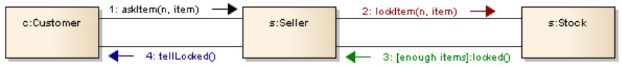{fig-alt="A Communication Diagram showing object links and numbered messages." width="60%"}

### Timing Diagrams
This diagram is used to explore the **precise time constraints** of an interaction. The axis is **horizontal for time** (often with a ruler), and the lifelines show their **change in state** over that time. It is a very specialized diagram, essential for real-time and embedded systems where meeting a deadline (e.g., "the airbag must deploy in < 15ms") is critical.

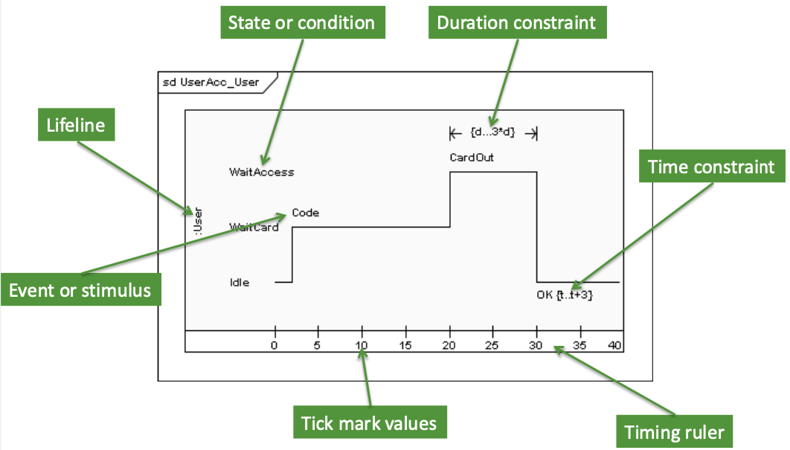{fig-alt="A Timing Diagram showing state changes along a time ruler." width="80%"}

## Conclusion: Pros and Cons

Interaction Diagrams, and Sequence Diagrams in particular, are a fundamental tool for analysts and developers.

* **Pros:**
    * They are highly intuitive and easy to read for simple scenarios.
    * They are excellent for documenting and validating use case scenarios.
    * They clearly show the responsibilities of each object (i.e., which messages it needs to handle), which directly helps in defining class operations.
    * They can be used to generate test cases.

* **Cons:**
    * They can become extremely large and complex ("spaghetti diagrams") very quickly.
    * They only show one specific path (one "story") at a time. It's impossible to model all possible paths in one diagram.
    * Advanced fragments (`par`, `strict`, `neg`) can be difficult to interpret correctly.

Despite these challenges, they remain one of the most valuable diagram types for communicating the dynamic behavior of an object-oriented system.