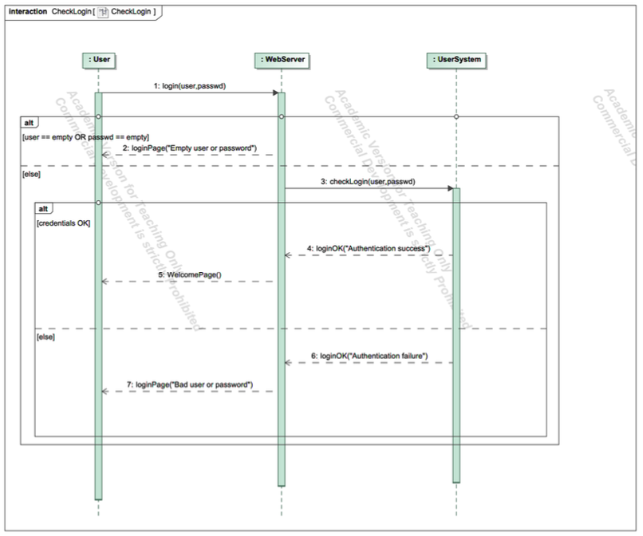
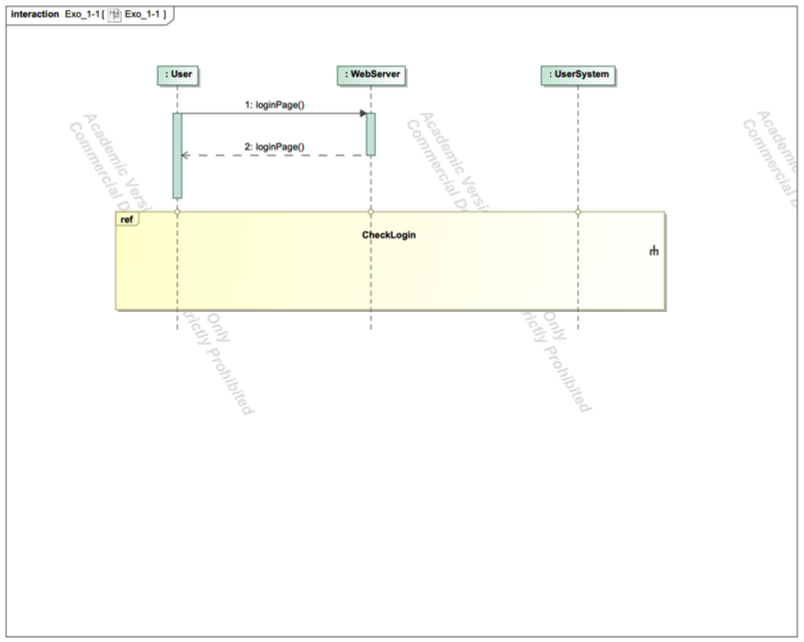
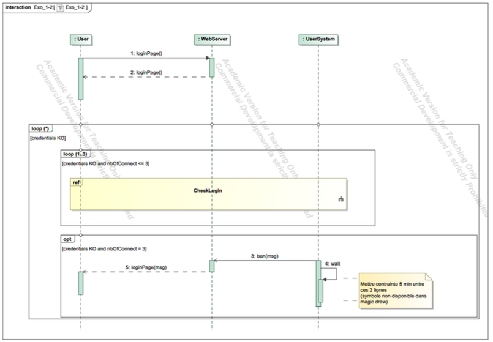
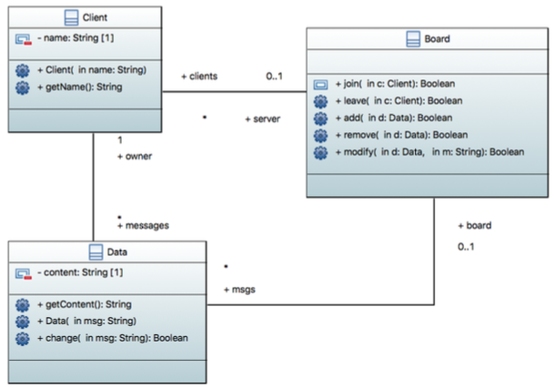
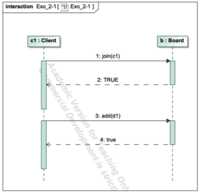
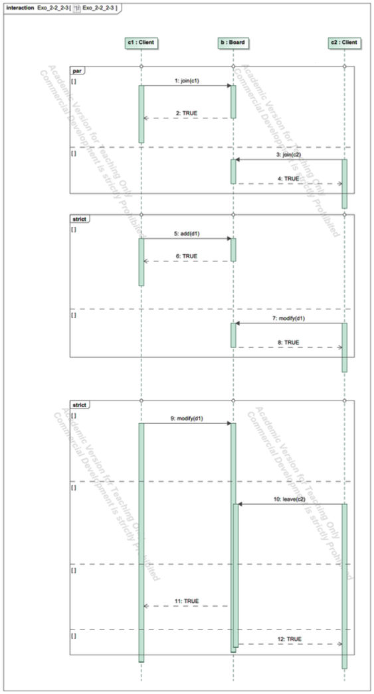

This chapter provides practical exercises to apply the concepts of UML Interaction Diagrams. You will model scenarios by focusing on lifelines, messages, and combined fragments to represent sequences, conditions, and loops.

### Exercise 1: You shall not pass

**Problem:**
Here is a scenario describing the interaction between a user and a generic website requiring authentication. After arriving at the login page, the user enters their username and password in the appropriate fields and clicks the "OK" button. The webpage checks if the user has entered both a login and a password.

If at least one of these fields is empty, an "EMPTY LOGIN OR PASSWORD" message is displayed on the login page.

If both pieces of information are present, they are sent to the user management system for verification. If the verification succeeds, the user management system returns an "AUTHENTICATION SUCCESS" message, otherwise, it returns "AUTHENTICATION FAILURE".

Based on the response from the user management system, the website either updates the login page to reflect that the user is authenticated, or an error message "WRONG USER LOGIN OR PASSWORD" is displayed on the login page.

**Task:**

1.  You are asked to provide the **sequence diagram** describing this basic scenario.
2.  You are asked to **complete/modify** the diagram to add a temporary ban mechanism: when the user enters incorrect login information three times in a row, they must wait five minutes before trying to log in again.

::: {.callout-tip collapse="true" title="Click to see the solution (Part 1 - Basic Login)"}

{fig-alt="Sequence diagram showing the basic login flow with alt fragments for error checking."}

{fig-alt="Sequence diagram showing the basic login flow with alt fragments for error checking."}

**Correction Details:**

* This solution uses three lifelines: `:User`, `:WebServer`, and `:UserSystem`.
* The entire interaction after the initial `login(user, passwd)` message is contained within a large **`alt` (Alternative)** fragment.
* **Operand 1:** The first operand checks the guard `[user == empty OR passwd == empty]`. If true, the `:WebServer` immediately sends a `loginPage("Empty user or password")` reply message to the `:User`.
* **Operand 2 (`[else]`):** If the fields are not empty, the `:WebServer` sends a synchronous `checkLogin(user, passwd)` message to the `:UserSystem`.
* **Nested `alt`:** A nested `alt` fragment is then used to handle the response from the `:UserSystem`.
    * **Nested Operand 1:** The guard is `[credentials OK]` (inferred from the "Authentication success" reply). The `:UserSystem` sends its `loginOK` reply, and the `:WebServer` follows up by sending a `WelcomePage()` message to the `:User`.
    * **Nested Operand 2 (`[else]`):** The guard `[credentials OK]` is false. The `:UserSystem` sends its `loginOK` reply (with "Authentication failure"), and the `:WebServer` sends a `loginPage("Bad user or password")` message back to the `:User`.

**Key Concepts Illustrated:**

* **Lifelines:** Representing the different actors and system components.
* **Synchronous/Reply Messages:** Modeling the call-and-response interactions.
* **`alt` Fragment:** Using nested `alt` fragments to clearly model the "if-then-else" logic of the scenario.
* **Guards:** Using conditions like `[user == empty OR passwd == empty]` and `[credentials OK]` to control the flow.

:::

::: {.callout-tip collapse="true" title="Click to see the solution (Part 2 - Temporary Ban)"}

{fig-alt="Sequence diagram showing nested loop fragments and an opt fragment for a temporary ban."}

**Correction Details:**

This solution modifies the first diagram by wrapping the logic in `loop` and `opt` fragments to handle the new requirements.

* An outer **`loop (*)`** (looping indefinitely) is added with a guard `[credentials KO]`. This entire interaction repeats as long as the user is not authenticated.
* Inside this, a **`loop (1..3)`** fragment is added with the guard `[credentials KO and nbOfConnect < 3]`. This allows the user up to 3 attempts.
* The **`ref` (Reference)** fragment `CheckLogin` is used inside this 3-try loop, calling the diagram we defined in Part 1.
* After the 3-try loop, an **`opt` (Optional)** fragment is used with the guard `[credentials KO and nbOfConnect == 3]`. This block is *only* executed if the user has failed all 3 attempts.
    * The `:WebServer` sends a `ban(msg)` to the `:UserSystem`.
    * The `:UserSystem` then enters a `wait` state (shown by its activation bar). A comment in the diagram notes this wait should last 5 minutes.
    * After the wait, a `loginPage(msg)` is sent back to the `:User`, and the outer `loop (*)` ensures the process can start over.

**Key Concepts Illustrated:**

* **`loop` Fragment:** Using nested loops to manage repeating interactions (infinite retries overall, but in batches of 3).
* **`ref` Fragment:** Reusing the `CheckLogin` interaction from Part 1 for modularity.
* **`opt` Fragment:** Using an optional fragment to model the "exception" case (the ban) that only happens on the 3rd failure.
* **Activation Bars:** Using an activation bar on the `:UserSystem` to represent the 5-minute `wait` period.

:::

### Exercise 2: Everybody wants to rule the world

**Problem:**
The "CrackBerry" software allows sharing information between employees or clients, sending files, or displaying a multimedia presentation on a shared screen called a virtual whiteboard.

Here are three possible scenarios between instances `c1...cn` of the CrackBerry software and an instance `b` of the whiteboard (`Board`):
1.  An instance `c1` connects to the virtual whiteboard `b` and displays new information on it.
2.  Two instances `c1` and `c2` connect. `c2` displays new information on the whiteboard, then `c1` modifies it.
3.  An instance `c1` modifies information on the whiteboard. An instance `c2` requests to disconnect and is **blocked** until `c1` has finished the modification.

**Context:**
A class diagram is provided showing that a `Client` can `join` or `leave` a `Board`, and can `add`, `remove`, or `modify` `Data` on that board. All these operations are synchronous (implying a reply).

{fig-alt="Class diagram showing Client, Board, and Data classes."}

**Task:**
You are asked to represent these three scenarios with a sequence diagram (**one diagram per scenario**).

::: {.callout-tip collapse="true" title="Click to see the solution (Scenario 1)"}

{fig-alt="Sequence diagram for Scenario 1: c1 joins and adds data."}

**Correction Details:**

This is a simple, linear sequence.
* **Lifelines:** `c1:Client` and `b:Board`.

* **Sequence:**

    1.  `c1` sends a synchronous message `join(c1)` to `b`.
    2.  `b` replies `TRUE`.
    3.  `c1` sends a synchronous message `add(d1)` to `b` (where `d1` is an instance of `Data`).
    4.  `b` replies `true`.

**Key Concepts Illustrated:**

* **Synchronous Messages:** Modeling the simple call-and-response flow.
* **Lifelines:** Representing the specific instances `c1` and `b`.

:::

::: {.callout-tip collapse="true" title="Click to see the solution (Scenario 2)"}

{fig-alt="Sequence diagram for Scenario 2, using par and strict fragments."}

**Correction Details:**

This scenario requires modeling concurrency and then a strict order.

* **Lifelines:** `c1:Client`, `b:Board`, and `c2:Client`.
* **`par` Fragment:** The diagram uses a **`par` (Parallel)** fragment to show that `c1` and `c2` can connect concurrently (in any order).
    * Operand 1: `c1` sends `join(c1)` to `b` and receives a `TRUE` reply.
    * Operand 2: `c2` sends `join(c2)` to `b` and receives a `TRUE` reply.
* **`strict` Fragment:** After the parallel block, a **`strict`** fragment is used to enforce the exact order of the following events.
    * *First*, `c2` sends `add(d1)` to `b` (and receives `TRUE`).
    * *Second*, `c1` sends `modify(d1)` to `b` (and receives `TRUE`).

**Key Concepts Illustrated:**

* **`par` Fragment:** Modeling concurrent actions (clients joining).
* **`strict` Fragment:** Enforcing a specific sequence of events (add *then* modify).

:::

::: {.callout-tip collapse="true" title="Click to see the solution (Scenario 3)"}

{fig-alt="Sequence diagram for Scenario 3, showing a blocking interaction."}

**Correction Details:**

This scenario is designed to illustrate how synchronous messages create a "blocking" behavior.

* **Lifelines:** `c1:Client`, `b:Board`, and `c2:Client`.
* **Sequence:**
    1.  `c1` sends a synchronous message `modify(d1)` to `b`. The activation bar on `b` shows it is now busy processing this request.
    2.  *While `b` is still busy with the modification*, `c2` sends a synchronous message `leave(c2)` to `b`.
    3.  `c2` is now **blocked**, waiting for a reply. Its activation bar starts and continues.
    4.  `b` *first* finishes the modification from `c1` and sends the `TRUE` reply back to `c1`.
    5.  *Only after* `c1`'s request is complete does `b` process `c2`'s request and send the `TRUE` reply back to `c2`.

This diagram visually represents `c2` being "blocked" because the reply to its message (`leave`) is only sent after the reply to `c1`'s message (`modify`) is complete.

**Key Concepts Illustrated:**

* **Synchronous Blocking:** The core concept of the exercise. The `c2` lifeline is forced to wait because the `b` lifeline is busy with `c1`'s request.
* **Activation Bars:** The overlapping activation bars on `b` clearly show it handling one request, then the next. The long activation bar on `c2` shows it is stuck waiting for a reply.

:::