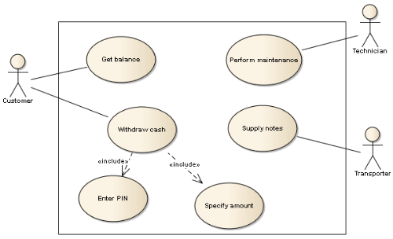
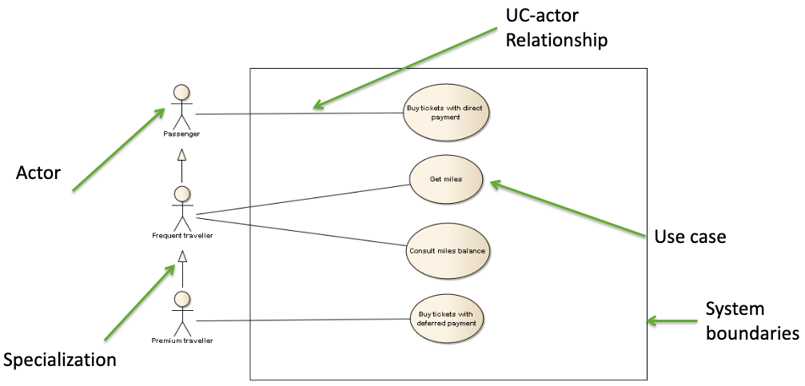

This chapter introduces the primary UML diagram for capturing **functional requirements**: the **Use Case Diagram**. We will explore its purpose, its core components (actors and use cases), the relationships that connect them, and how the diagram serves as a "map" for detailed textual descriptions.

## Overview of Use Case Diagrams

A Use Case Diagram is a behavioral diagram that provides a high-level, external view of a system. Its main purpose is to capture a system's functional requirements by showing how "actors" (external entities) interact with the system to achieve specific "use cases" (goals).

It's crucial to understand that a Use Case modeling effort has two distinct parts:

1.  **The Use Case Diagram:** This is the graphical "map" or table of contents. It shows all the system's functionalities (use cases), who uses them (actors), and how they relate to each other.
2.  **The Use Case Description:** This is the detailed "content." For each use case oval on the diagram, a corresponding textual description (often using a structured template) explains the step-by-step interaction, including the main success scenario and all alternative paths or errors.

UML formally standardizes only the diagram, but the textual description is arguably the most valuable part of the requirements-gathering process.

## Core Concepts: Actors and Goals

The Use Case approach is built on two fundamental concepts: the **Actor** and the **Use Case**.

### The Actor: An External Role
An **Actor** represents a *role* played by an entity that interacts with the system. It is something *outside* the system boundary.

* An actor is not necessarily a human. It can be another computer system, a hardware device, or a time-based event.
* One person might play multiple roles (e.g., a "Librarian" actor and a "Borrower" actor, even if the same person does both).
* **Primary Actor:** The actor who initiates the use case to achieve a goal (e.g., the `Customer` in `Withdraw cash`).
* **Secondary Actor:** An actor who assists the system in completing the use case (e.g., the `SNCB Booking System` which is queried by the `Buy a ticket` use case).

::: {.callout-note icon="true" title="Formal Definition: Actor"}
An **Actor** specifies a role played by an external entity that interacts with the system. It is drawn as a stick figure.
:::

### The Use Case: A Stakeholder's Goal
A **Use Case** represents a specific goal that an actor wants to achieve with the system. It describes a complete interaction from the actor's perspective.

* It is named with a verb phrase (e.g., `Get balance`, `Perform maintenance`).
* It must provide an observable, value-added result to the actor. "Log in" is generally a poor use case, as no one logs in just to log in; they log in to *do something else* (like "Buy a ticket").
* A use case is a *set of scenarios*. It contains the "happy path" (Main Success Scenario) and all alternative or error paths (Extensions).

::: {.callout-note icon="true" title="Formal Definition: Use Case"}
A **Use Case** represents a system behavior that accomplishes a stakeholder's goal. It is drawn as an ellipse (oval).
:::

### The Scenario: A Single Story
A **Scenario** is a single, concrete path through a use case. For the `Withdraw cash` use case, there are many scenarios:
* Scenario 1: The withdrawal is successful.
* Scenario 2: The user enters the wrong PIN.
* Scenario 3: The user has insufficient funds.

The Use Case textual description gathers all these scenarios related to the same goal.

## Anatomy of a Use Case Diagram

The diagram itself is a simple visual "map" combining four main elements.

{fig-alt="A UML Use Case Diagram for an ATM." width="80%" fig-align="center"}

1.  **Actors:** The stick figures outside the box (e.g., `Customer`, `Technician`).
2.  **Use Cases:** The ovals inside the box (e.g., `Withdraw cash`, `Get balance`).
3.  **System Boundary:** The large rectangle that separates the system (what we are building) from the external world (the actors).
4.  **Relationships:** The lines connecting the elements, which are explained in the next section.

## Relationships in Use Case Diagrams

There are four primary types of relationships used in these diagrams.

### Association
This is a solid line connecting an **Actor** to a **Use Case**. It simply indicates that the actor *participates* in that use case. This is the most common relationship.

### Generalization
A solid line with a **hollow triangle arrowhead**, this represents an "is a" relationship. It can be used in two ways:

* **Actor Generalization:** Shows that one actor is a more specialized version of another. For example, a `Frequent traveller` actor "is a" `Passenger`. The specialized actor inherits the ability to participate in all use cases of the general actor (plus their own specific ones).
* **Use Case Generalization:** (Less common) Shows that one use case is a more specific way of achieving the goal of another.

{fig-alt="A diagram showing 'Premium traveller' inheriting from 'Frequent traveller'." width="80%"}

### `<<include>>`
An `<<include>>` relationship is a dashed arrow pointing from a base use case to an *included* use case.

* **Purpose:** To factor out common behavior that is **required** by multiple use cases.
* **Logic:** The base use case *must* execute the included use case at some point. It is **unconditional**.
* **Example:** Both `Withdraw cash` and `Get balance` might `<<include>>` an `Enter PIN` use case. You cannot do either without first entering the PIN.

### `<<extend>>`
An `<<extend>>` relationship is a dashed arrow pointing from an *extending* use case back to a base use case.

* **Purpose:** To model **optional** or exceptional behavior that only happens under certain conditions.
* **Logic:** The base use case can run perfectly fine on its own. The extending use case *optionally* "jumps in" and adds extra steps if its condition is met.
* **Example:** An `Additional operations` use case might `<<extend>>` the `Get miles` use case. Most of the time, the user just gets their miles and leaves, but *optionally*, they might choose to perform additional operations.

::: {.callout-warning title="`<<include>>` vs. `<<extend>>`"}
This is a common point of confusion. Remember:

* **`<<include>>` ("Always"):** The base UC *needs* the included one. The base UC's flow is *incomplete* without it. (Arrow points **to** the required part).
* **`<<extend>>` ("Maybe"):** The base UC *doesn't need* the extending one. The base UC is *complete* on its own. The extension adds optional functionality. (Arrow points **to** the base case being extended).
:::

## Writing Use Cases: The Textual Content

The diagram is just the map. The real requirements are in the textual descriptions. While UML doesn't standardize the format, a good template is essential.

A typical process involves:

1.  Identify Primary Actors.
2.  Identify their main goals (the Use Cases).
3.  For each Use Case, write the **Main Success Scenario** (the "happy path" where everything works perfectly).
4.  Identify all **Extensions** (alternative paths, error conditions, failures) and add them to the description.

### A Common Use Case Template
A detailed use case description often includes fields like:

* **Name:** A short, goal-oriented verb phrase (e.g., "Get miles").
* **Actors:** The primary actor (initiator) and any secondary actors.
* **Pre-conditions:** Assertions about the state of the system that *must* be true *before* the use case can start (e.g., "The machine is running and ready"). This is **not** the event that starts the use case.
* **Post-conditions:** A guarantee of what will be true *after* the use case finishes (e.g., "Passenger's miles have been credited" on success, or "Miles have not been credited" on failure).
* **Main Success Scenario:** A numbered list of simple actor-system interactions (e.g., 1. Actor inserts card. 2. System checks card...).
* **Extensions:** A list of alternative paths, often branching from specific steps in the main scenario (e.g., "2a. Card is invalid: System signals error...").

## Conclusion: Pros and Cons

Use Cases are a powerful but informal tool for requirements analysis.

* **Pros:**
    * **Understandable:** They are written in natural language, making them easy for both technical teams and non-technical stakeholders (users, clients) to read and validate.
    * **User-Centric:** They force analysis to be from the user's (actor's) perspective, focusing on *what* the system must do (the "what/why"), not *how* it does it.
    * **Black-Box View:** They treat the system as a "black box," avoiding implementation or GUI details too early in the process.

* **Cons:**
    * **Informal:** Natural language can be ambiguous. What does "check ticket validity" *really* mean? This requires a separate vocabulary or domain model to clarify.
    * **Combinatorial Explosion:** For complex systems, the number of extensions can become massive, making the use case descriptions hard to manage.
    * **Not Executable:** Being informal, they cannot be directly executed or rigorously checked for completeness or consistency in the same way as a formal model.