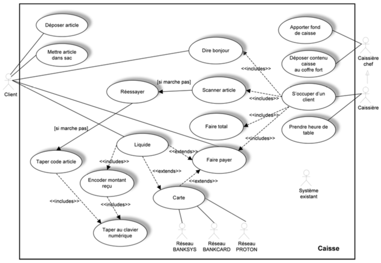
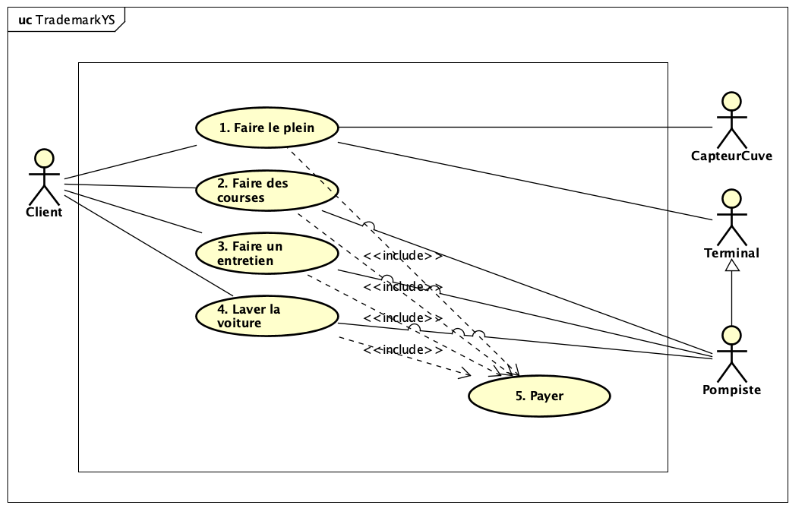

This chapter provides practical exercises for applying the concepts of UML Use Case Diagrams. The exercises focus on identifying modeling errors and on creating a new diagram from a textual description, paying close attention to actors, goals, and relationships.

### Exercise 1: What's wrong, Doctor?

**Problem:**
Based on the concepts covered in the theory lectures, you are asked to identify the errors appearing in the Use Case Diagram below.

{fig-alt="An incorrect Use Case Diagram to be analyzed."}

**Task:**
Identify all the modeling errors in this diagram.

::: {.callout-tip collapse="true" title="Click to see the solution"}

**Correction Details:**

Here is a list of the errors and modeling issues found in the diagram:

1.  **Actors Inside Boundary:** The `Système existant` (Existing System) and `Réseau...` (Network...) actors are placed *inside* the system boundary box. All actors must be external to the system.
2.  **Reversed Generalization:** The specialization arrow between `Caissière chef` (Head Cashier) and `Caissière` (Cashier) is reversed. The arrow should point from the specialized actor (`Caissière`) to the general actor (`Caissière chef`).
3.  **Unclear Main Scenarios:** The diagram does not clearly represent the primary, high-level goals of the actors.
4.  **Poor Use Case Naming (No Goal/Value):** Several use cases represent single steps or UI interactions, not user goals. For example, `Taper au clavier numérique` ("Type on numeric keypad") is a step, not a goal that provides value to the actor.
5.  **Unconnected Actor:** The `Système existant` actor is not connected to any use case, so its purpose in the diagram is unknown.
6.  **Unclear System Boundary:** The boundary box is labeled "Caisse" (Checkout), which is ambiguous. It's not clear if this is the name of the system being built or a department.
7.  **Incorrect Use of Associations:** The alternative case `Réessayer` ("Try again") should likely be an `<<extend>>` relationship modifying a main use case, not a standalone use case initiated by the actor.
8.  **Confusing Relationships:** The `Liquide` (Cash) use case has multiple `<<extends>>` relationships and an `<<include>>` relationship, creating a confusing and likely incorrect structure.
9.  **Misuse of `<<include>>`:** The `Encoder montant reçu` ("Enter amount received") use case is included by only one other use case. The `<<include>>` relationship is intended to factor out behavior *common* to *multiple* use cases.
10. **Invalid Notation:** The label `[si marche pas]` ("if it doesn't work") is not a valid UML Use Case construct. This logic should be represented by extension points and `<<extend>>` relationships.
11. **Poor Naming:** The naming for exception cases (like `Réessayer`) is not descriptive of a user goal.

**Key Concepts Illustrated:**

* Actors must be **external** to the system.
* Generalization (specialization) arrows point from the **subclass (specific)** to the **superclass (general)**.
* A use case must represent a **complete user goal** that provides **added value**, not a single, trivial step.
* `<<include>>` is for **mandatory, common** behavior.
* `<<extend>>` is for **optional, alternative** behavior.

:::

### Exercise 2: YellowStone

**Problem:**
You are asked to model the use cases of the Yellow Stone management system for its end-users, in the form of a Use Case Diagram. Be sure to clearly distinguish the different roles.

**Note:** At this stage, do not write textual descriptions or invent exceptional/exotic cases not mentioned in the text.

**Context:**
The Yellow Stone station is investing in new software. The system must be able to manage all of the station's services.

* **Primary Service:** Fueling (`Prise de carburant`).
* **Other Services:** In-station purchases (`achats au sein de la station`), and in the future, car wash (`lavage`) and maintenance (`entretien`).
* **Payment:** "Each payment for a service (fuel, purchases, wash, maintenance) results in a timestamped customer transaction." This implies payment is a required part of all services.
* **Fueling Process:**
    * The fueling process requires explicit authorization.
    * Authorization can come from the **attendant's terminal** (`terminal du pompiste`) or the **automated payment terminal** (`terminal de paiement automatisé`).
    * A **tank level sensor** (`capteur de niveau dans les cuves`) is checked. If the level is too low (< 3%), arming is prevented, and the **attendant** (`pompiste`) is notified of the need to order a refill.

**Task:**
Create the Use Case Diagram for the Yellow Stone system based on the description.

::: {.callout-tip collapse="true" title="Click to see the solution"}

{fig-alt="The Use Case Diagram for the YellowStone system."}

**Correction Details:**

The solution diagram correctly identifies the actors and their goals:

* **Actors:**
    * `Client`: The primary actor who initiates all services.
    * `Pompiste` (Attendant): A secondary actor who participates in the `Faire le plein` (Refuel) use case (by providing authorization) and is also notified by the `CapteurCuve`.
    * `Terminal`: A secondary actor, also participating in `Faire le plein` (by providing authorization). The diagram shows it as a *specialization* of `Pompiste` (an automated attendant).
    * `CapteurCuve` (Tank Sensor): A secondary actor (a device) that interacts with `Faire le plein` (to provide the level) and the `Pompiste` (to send a low-level alert).

* **Use Cases:**
    The diagram identifies four main, high-level goals for the `Client`:
    1.  `Faire le plein` (Refuel)
    2.  `Faire des courses` (Go shopping)
    3.  `Faire un entretien` (Do maintenance)
    4.  `Laver la voiture` (Wash car)

* **`<<include>>` Relationship:**
    Based on the text "Each payment for a service...", the diagram correctly identifies `5. Payer` (Pay) as a separate, included use case. All four main services have an `<<include>>` relationship pointing to `Payer`, indicating that payment is a mandatory, common part of completing any of those services.

**Key Concepts Illustrated:**

* **Identifying Actors:** Correctly distinguishing between the primary user (`Client`) and the various secondary actors (human `Pompiste`, hardware `CapteurCuve`, and system `Terminal`).
* **Actor Generalization:** Using generalization to show that the `Terminal` plays a similar (but more specialized) role to the `Pompiste`.
* **Identifying Goals:** Defining clear, high-level goals for the user (`Faire le plein`, `Faire des courses`, etc.) rather than low-level steps.
* **Using `<<include>>`:** Correctly factoring out the `Payer` functionality, which is mandatory and common to all other main use cases.

:::
